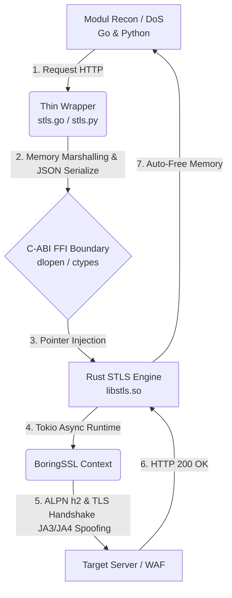

# ⚡ STLS (Storm Transport Layer Security)

### Weaponized WAF Evasion & TLS Fingerprinting Engine for Storm Framework.

STLS is not just an HTTP Client. This is a network-level clone of Google Chrome 120+ identities compressed into an asynchronous architecture with advanced memory efficiency.

Built on top of the BoringSSL engine (the original cryptographic DNA of Google Chrome), STLS is designed to break through the most paranoid Web Application Firewall (WAF) defenses in the industry such as Cloudflare (Turnstile), Akamai Bot Manager, and Datadome—all without the heavy computational overhead of headless browsers (Selenium/Puppeteer).

## 🧬 Perfect Genetic Clone (BoringSSL)

Does not use OpenSSL or the language’s default cryptographic libraries. STLS literally uses the same C-based BoringSSL library that powers Chrome to ensure precise synchronization of cipher suites and extensions.

**🛡️ God-Tier Fingerprint Metrics:**
- **JA3/JA4 Spoofing:** Dynamic with GREASE injection that keeps the signature constantly changing but still recognizable as genuine Chrome.
- **Akamai HTTP/2 Fingerprint:** Manipulating the giant Window Update frame (15663105) and Header Lexical Ordering to bypass HTTP/2 protection.

**🚀 Post-Quantum Cryptography (PQC):**

Fully supports X25519Kyber768 hybrid key exchange, a mandatory requirement for bypassing modern Cloudflare detections.

**🧠 Polyglot Memory-Safe C-ABI:**

The core engine is written in Rust (memory-safe, extreme concurrency via Tokio), and is then exposed through a C Foreign Function Interface (FFI) to Go and Python wrappers using dynamic dlopen memory injection techniques. Zero memory leaks.

## 🏗️ Under the Hood Architecture

How the STLS ecosystem interacts within the Storm Framework:



## 💻 Developer Experience (DX): Brutally Simple

Ignoring the complexities of C-ABI negotiation, FFI, and BoringSSL configuration on the backend, Storm Framework users only need to write code as elegant as this:

**Python:**

```python
import stls
import smf

# WAF killer machine in 3 lines of code
response = stls.get("https://tls.peet.ws/api/all", headers={"User-Agent": "Chrome..."})
smf.printf(response.json()['tls']['ja3_hash'])
```

**Golang:**

```golang
import "github.com/StormWorld0/storm-framework/scripts/wrapper/stls_go"

func main() {
    stls.InitSTLS() // Dynamic injection into C-ABI memory (O(1) Traversal)
    
    res, _ := stls.Post("https://api.target.com", headers, []byte(`{"bypass": true}`))
    fmt.Println(res.Text)
}
```

## 📊 Proof of Evasion (WAF Metrics)

Tested against tls.peet.ws/api/all (Industry Standard TLS Analyzer)

HTTP Version Negotiated : h2  
JA3 Fingerprint Hash    : f3141bee80aafd926abf6eb95f3083bd  
JA4 Fingerprint Hash    : t13d1513h2_8daaf6152771_1eb89897b454  
Akamai H2 Fingerprint   : c237f980db4bbcd5b38702c2176a8ec9 (100% Validated)  
Travel Time             : ~1.49 seconds (termasuk C-FFI bridging overhead)  

